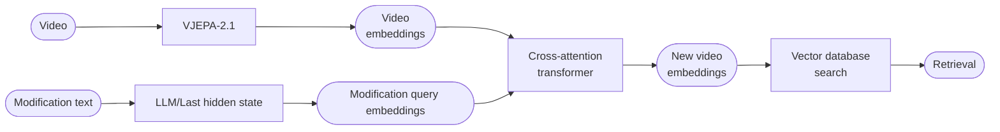
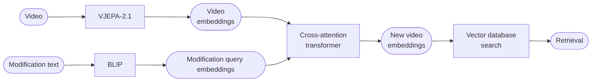

# COVR

**Reasoning-based video retrieval requiring models to interpret causal, temporal, and semantic modifications across video pairs.**

_Given an original video and its corresponding description, along with a separate modification text specifying certain changes, the goal is to retrieve a new video that accurately reflects these changes while preserving the relevant aspects of the original scene._

Participants' models will be evaluated based on their ability to accurately retrieve the modified video given an original video and a modification text. The primary factors considered in evaluation include:

- **Relevance**: The retrieved video must match both the original video’s context and the modifications described in the text query.
- **Ranking Performance**: Higher-ranked correct results indicate better performance, as users typically expect relevant videos to appear within the top recommendations.
- **Generalization**: The model should be effective across various video categories, object transformations, scene changes, and modifications of different complexity levels.

The primary evaluation metric used in this challenge is **Recall@K (R@K)**, which measures the percentage of queries where the correct target video appears within the top-K retrieved results. The recall scores will be computed at different values of K, including 1, 5, 10, and 50

## Pipeline

**With `kyrielw/Rich-Txt-Edit-CoVR`**

1. VJEPA + **FLAN** + CROSS ATTENTION (also try **QWEN**)



2. VJEPA + **BLIP** + CROSS ATTENTION



**Other ideas**

- maxSim for embedding patches
- Instead of rich text representations, langchain for short modifications in test dataset and pass to CLIP/BlIP
- Use QWEN for query embeddings

#### VJEPA-2.1

Videos are encoded offline using a frozen **V-JEPA 2.1 ViT-Base/Gigantic** backbone into patch-level embeddings stored as `.pt` files.

```
video.mp4
    ↓  downsample to 4 FPS (matching V-JEPA pretraining)
[C, T, H, W]
    ↓  chunk into 16-frame clips (= 4 seconds each)
[1, C, 16, H, W] × n_chunks  →  V-JEPA  →  [N, 768] per chunk
    ↓  concatenate
[sum_N, 768]  →  saved as {source_video_id}.pt
```

Each video produces a variable-length tensor `[sum_N, 768]` where `sum_N` grows with video duration.

At retrieval time, either:
    - **MaxSim** used to score a query vector against all frame-level embeddings
    - **Mean-pool** over `N` to get a 1D video vector.

#### FLAN encoder

LLM, use last hidden state

#### Cross-attention transfomer

The VJEPA paper explicitly validates that 4 blocks is sufficient for attentive probing on top of frozen V-JEPA features across multiple hard benchmarks

Operates on all N = T×S video patches at once, and V-JEPA's RoPE positional encoding is baked into those tokens, so the self-attention layers already distinguish early vs late frames before the text cross-attention runs.

The problem is that when we retrieve the final vector, the dimension goes from [B, N, vjepa_dim] -> [B, emb_dim]. This way, we lose a lot of temporal information.

1. Keep this approach: Pools both spatially and temporally. Uses cosine similarity, more straightforward.

2. Pool only spatially: Preserves temporal information, but then MaxSim has to be used, retrieves highest score from a single frame as the score.

> Try to implement MaxSim but with top-k mean

#### Future: temporal relevance in query embeddings

`CrossAttentionFusion` currently mean-pools the text-conditioned patch tokens before projecting to `embed_dim`. This loses per-frame structure but keeps similarity as a single dot product, which is compatible with ANN search at retrieval time.

If the model fails to capture *which frames* are relevant to a query, consider late interaction:

1. **Remove mean-pool from `CrossAttentionFusion`** — return `[N, embed_dim]` instead of `[embed_dim]`.
2. **Aggregation options for similarity:**
   - Max-sim (ColBERT-style): `sim(q, g) = max over N of (q_n · g)` where `g` is the pooled gallery embedding.
   - Chamfer / sum-max: symmetric, both query and gallery keep `[N, D]`.
3. **`InfoNCELoss` needs to change** — similarity is no longer a plain dot product; replace
   `query_emb @ target_emb.T` with the chosen aggregation.
4. **Retrieval cost**: late interaction breaks standard FAISS dot-product indexing.
   Options: PLAID-style candidate re-ranking, or pre-cluster frame embeddings.

Only worth doing if ablations show the pooled model misses temporally-grounded queries.

## Done so far

`scripts/`
- `download_dataset.py` -> loads videos + json
- `encode_gallery.py` -> loads vjepa2.1 model (base for 'dev', giant for 'prod'), embeds vids and saves to `video_embeddings`
- `encode_queries.py` -> loads flan-t5 model (large for 'dev', xl for 'prod), embeds queries and saves to `query_embeddings`

`covr/`
- `models/`: `vjepa.py`, `flan_t5_encoder.py`

## TODO

- [ ] vjepa batch size > 1
- [ ] compare text encoders: CLIP vs FLAN
- [ ] fix problems with NaNs in some videos. i think this is mostly because of the 16x16 requirement of the patches.ç
- [ ] ablation in d_model=512
        Check if the model is underfitting (loss plateaus high, Recall@K is low even on training set): capacity is the bottleneck -> bump to 768 or 1024

## Changes to original idea

- CLIP's text encoder was trained via contrastive alignment with images, so it's optimized for **short**, descriptive captions, not for instruction-style text that describes transformations.

- Use text embeddings as values?


---

## Installation

1. Clone the repository and install all dependencies (including development dependencies) with `uv`:

```bash
git clone git@github.com:jacoboromerodiaz/video-retrieval-cvpr.git
cd video-retrieval-cvpr
uv sync --dev
source .venv/bin/activate
```

> If uv is not installed `curl -LsSf https://astral.sh/uv/install.sh | sh`

2. Install the required datasets:

```bash
python scripts/download_dataset.py
python scripts/download_covr_videos.py --split "train" --data_dir "covr/data/rich-text-covr/videos"
```

3. Encode gallery videos

```bash
python scripts/encode_gallery.py --config configs/encoder/vjepa/vjepa_train_prod.yaml

python scripts/encode_gallery.py --config configs/encoder/vjepa/vjepa_val_prod.yaml

python scripts/encode_gallery.py --config configs/encoder/vjepa/vjepa_test_prod.yaml
```

After the first run, `torch.hub` caches the vjepa2 repo locally with a hardcoded
internal Meta URL that breaks weight downloads. Patch it:

```bash
sed -i '' 's|http://localhost:8300|https://dl.fbaipublicfiles.com/vjepa2|g' \
    ~/.cache/torch/hub/facebookresearch_vjepa2_main/src/hub/backbones.py
```

4. Encode queries

```bash
python scripts/encode_queries.py --config configs/encoder/flan/flan_train_prod.yaml

python scripts/encode_queries.py --config configs/encoder/flan/flan_val_prod.yaml

python scripts/encode_queries.py --config configs/encoder/flan/flan_test_prod.yaml
```

5. Train cross attention transformer!

```bash
python scripts/train_cross_attention.py --config configs/train/cross_attention_prod.yaml
```

---

## Issues

### V-JEPA 2 hub cache patch

After the first run, `torch.hub` caches the vjepa2 repo locally with a hardcoded
internal Meta URL that breaks weight downloads. Patch it:

```bash
sed -i '' 's|http://localhost:8300|https://dl.fbaipublicfiles.com/vjepa2|g' \
    ~/.cache/torch/hub/facebookresearch_vjepa2_main/src/hub/backbones.py
```

