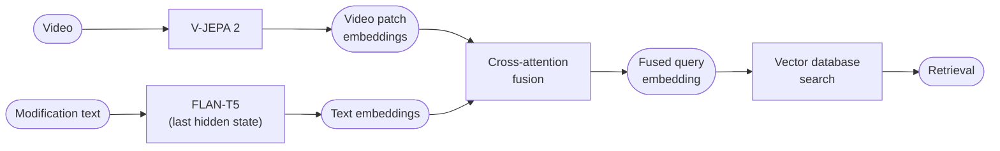

# COVR — Composed Video Retrieval

**Reasoning-Aware Composed Video Retrieval (CoVR-R) challenge 2026**
<br>https://eval.ai/web/challenges/challenge-page/2686/overview

**Reasoning-based video retrieval: given an original video and a modification text, retrieve the video that reflects the described changes while preserving the rest of the original scene.**

---

> ### ⚠️ Project status
>
> This was my entry for the CoVR-R 2026 challenge. **I did not finish it before the deadline**, so it was never submitted. The encoding and training pipeline works end-to-end, but the **evaluation and submission-generation stages were never implemented**.
>
> I'm leaving the repository public in case the architecture or the encoding pipeline is useful to anyone building a composed video retrieval system. Treat it as a starting point, not a finished product.

---

## Task

Given:

- an **original video** (with its description), and
- a **modification text** describing causal, temporal, or semantic changes,

retrieve the **target video** that reflects those changes while preserving the relevant aspects of the original scene. Submissions are scored with **Recall@K** (R@1, R@5, R@10, R@50) — the fraction of queries whose correct target appears in the top-K results.

## Architecture

Videos are encoded offline with a frozen **V-JEPA 2** backbone, modification texts with a frozen **FLAN-T5** encoder. A trainable **cross-attention** module fuses the text query into the video patch embeddings to produce a single retrieval vector, which is matched against the gallery with cosine similarity / ANN search.



**Stages**

- **Video encoder** — a frozen V-JEPA 2 ViT (Base for `dev`, Giant for `prod`) encodes each video into patch-level embeddings. Videos are downsampled to 4 FPS and chunked into 16-frame clips, producing a variable-length tensor `[N, 768]` saved per video.
- **Text encoder** — FLAN-T5 (Large for `dev`, XL for `prod`) encodes the modification text; the last hidden state is used as the text embedding.
- **Cross-attention fusion** — `CrossAttentionFusion` conditions the video patch tokens on the text query and pools to a single `embed_dim` vector. Trained jointly with a `GalleryEncoder` using an InfoNCE / hard-negative NCE contrastive loss.
- **Retrieval** — fused query embeddings are matched against gallery embeddings by cosine similarity.

## Repository layout

```
covr/
  models/        vjepa.py, flan_t5_encoder.py, cross_attention.py, query_expander.py, pipeline.py
  data/          dataset definitions, collate, challenge JSON/CSV splits
  retrieval/     index.py (vector search)
  evaluation/    metrics.py (recall_at_k)
  utils/         gdrive.py (upload helpers)
scripts/         pipeline entry points (download → encode → train)
configs/         YAML configs, each with dev/prod × train/val/test variants
  encoder/vjepa/ video-encoding configs
  encoder/flan/  query-encoding configs
  train/         cross-attention training configs
features/        encoded embeddings (gallery/ and queries/)
```

Most configs come in a `*_dev.yaml` variant (small models, quick local iteration) and a `*_prod.yaml` variant (full models), split into `train` / `val` / `test`.

## Installation

Requires Python ≥ 3.12. Dependencies are managed with [`uv`](https://docs.astral.sh/uv/).

```bash
git clone git@github.com:jacoboromerodiaz/video-retrieval-cvpr.git
cd video-retrieval-cvpr
uv sync --dev
source .venv/bin/activate
```

> If `uv` is not installed: `curl -LsSf https://astral.sh/uv/install.sh | sh`

## Usage

The pipeline runs in four steps. All encoding/training scripts take a `--config` pointing at one of the YAMLs under `configs/`.

**1. Download the datasets and videos**

```bash
python scripts/download_dataset.py
python scripts/download_covr_videos.py \
    --json_path covr/data/webvid2m-covr_paths-cvprw_train.json \
    --data_dir  covr/data/rich-text-covr/videos
```

**2. Encode the gallery videos (V-JEPA 2)** → `features/gallery/`

```bash
python scripts/encode_gallery.py --config configs/encoder/vjepa/vjepa_train_prod.yaml
python scripts/encode_gallery.py --config configs/encoder/vjepa/vjepa_val_prod.yaml
python scripts/encode_gallery.py --config configs/encoder/vjepa/vjepa_test_prod.yaml
```

**3. Encode the queries (FLAN-T5)** → `features/queries/`

```bash
python scripts/encode_queries.py --config configs/encoder/flan/flan_train_prod.yaml
python scripts/encode_queries.py --config configs/encoder/flan/flan_val_prod.yaml
python scripts/encode_queries.py --config configs/encoder/flan/flan_test_prod.yaml
```

**4. Train the cross-attention model**

```bash
python scripts/train_cross_attention.py --config configs/train/cross_attention_prod.yaml
```

> Swap any `_prod` config for its `_dev` counterpart to iterate quickly with smaller models.

### Troubleshooting: V-JEPA 2 hub cache

After the first run, `torch.hub` caches the V-JEPA 2 repo with a hardcoded internal Meta URL that breaks weight downloads. Patch it once:

```bash
sed -i '' 's|http://localhost:8300|https://dl.fbaipublicfiles.com/vjepa2|g' \
    ~/.cache/torch/hub/facebookresearch_vjepa2_main/src/hub/backbones.py
``

## Datasets

- [`kyrielw/Rich-Txt-Edit-CoVR`](https://huggingface.co/datasets/kyrielw/Rich-Txt-Edit-CoVR) — training set
- [`orange-fox/CoVR-R`](https://huggingface.co/datasets/orange-fox/CoVR-R) — validation / test sets
