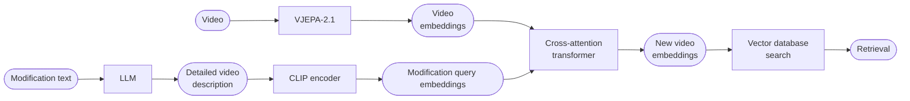
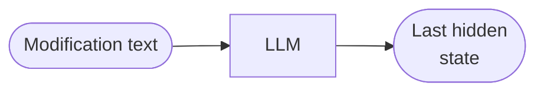

# COVR

**Reasoning-based video retrieval requiring models to interpret causal, temporal, and semantic modifications across video pairs.**

_Given an original video and its corresponding description, along with a separate modification text specifying certain changes, the goal is to retrieve a new video that accurately reflects these changes while preserving the relevant aspects of the original scene._

Participants' models will be evaluated based on their ability to accurately retrieve the modified video given an original video and a modification text. The primary factors considered in evaluation include:

- **Relevance**: The retrieved video must match both the original video’s context and the modifications described in the text query.
- **Ranking Performance**: Higher-ranked correct results indicate better performance, as users typically expect relevant videos to appear within the top recommendations.
- **Generalization**: The model should be effective across various video categories, object transformations, scene changes, and modifications of different complexity levels.

The primary evaluation metric used in this challenge is **Recall@K (R@K)**, which measures the percentage of queries where the correct target video appears within the top-K retrieved results. The recall scores will be computed at different values of K, including 1, 5, 10, and 50

## Pipeline

**CLIP** has been changed to FLAN by now.



#### Cross-attention transfomer

The VJEPA paper explicitly validates that 4 blocks is sufficient for attentive probing on top of frozen V-JEPA features across multiple hard benchmarks

Operates on all N = T×S video patches at once, and V-JEPA's RoPE positional encoding is baked into those tokens, so the self-attention layers already distinguish early vs late frames before the text cross-attention runs.

The problem is that when we retrieve the final vector, the dimension goes from [B, N, vjepa_dim] -> [B, emb_dim]. This way, we lose a lot of temporal information.

1. Keep this approach: Pools both spatially and temporally. Uses cosine similarity, more straightforward.

2. Pool only spatially: Preserves temporal information, but then MaxSim has to be used, retrieves highest score from a single frame as the score.

> Try to implement MaxSim but with top-k mean


#### Possible changes to pipeline


## Done so far

`scripts/`
- `download_dataset.py` -> loads videos + json
- `encode_gallery.py` -> loads vjepa2.1 model (base for 'dev', giant for 'prod'), embeds vids and saves to `video_embeddings`
- `encode_queries.py` -> loads flan-t5 model (large for 'dev', xl for 'prod), embeds queries and saves to `query_embeddings`

`covr/`
- `models/`: `vjepa.py`, `flan_t5_encoder.py`

## TODO

- [ ] vjepa batch size > 1
- [ ] compare text encoders: CLIP vs FLAN
- [ ] fix problems with NaNs in some videos. i think this is mostly because of the 16x16 requirement of the patches.ç
- [ ] ablation in d_model=512
        Check if the model is underfitting (loss plateaus high, Recall@K is low even on training set): capacity is the bottleneck -> bump to 768 or 1024

## Changes to original idea

- CLIP's text encoder was trained via contrastive alignment with images, so it's optimized for **short**, descriptive captions, not for instruction-style text that describes transformations.

- Use text embeddings as values?

- Implement cross-attention directly in VJEPA?

---

## Installation

Clone the repository and install all dependencies (including development dependencies) with `uv`:

```bash
git clone git@github.com:jacoboromerodiaz/video-retrieval-cvpr.git
cd video-retrieval-cvpr
uv sync --dev
```

---

## Issues

### V-JEPA 2 hub cache patch

After the first run, `torch.hub` caches the vjepa2 repo locally with a hardcoded
internal Meta URL that breaks weight downloads. Patch it:

```bash
sed -i '' 's|http://localhost:8300|https://dl.fbaipublicfiles.com/vjepa2|g' \
    ~/.cache/torch/hub/facebookresearch_vjepa2_main/src/hub/backbones.py
```

